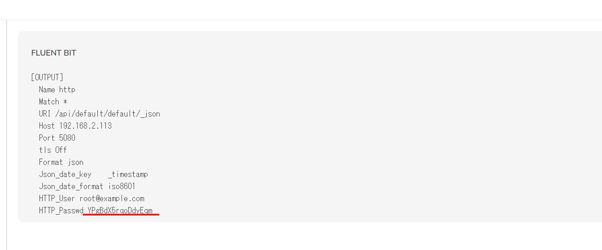

# openobserve_docker

openobserveをdockerで動かしてみる

```
cadvisor <-- prometheus -- (remote write) --> openobserve --> minio
```

- cadvisor: コンテナ情報を収集
- prometheus: cadvisorからメトリクスを収集してopenobserveへ投げ込む
- openobserve: 監視ツール
- minio: openobserveのデータを保存するストレージ

## 動作環境

Host OS: Ubuntu 22.04.2 LTS

以下がインストールされていれば動くはず...

- gum ([charmbracelet/gum](https://github.com/charmbracelet/gum))
  - shellの該当部分を書き換えればいいので必須ではない
- docker
- docker compose

## 手順

### #1 Launch openobserve container

```
./bin/launch.sh
```

### #2 Launch containers for monitoring

http:localhost:5080/web/ingestion/metrics/prometheus?org_identifier=default  
へアクセスする

ID/PASS: `root@example.com / Complexpass#123`

<p></p>

パスワード部分をコピーして書き換え `services/prometheus/prometheus.yml` のremote_writeの部分を書き換え

```yml
remote_write:
  - url: http://openobserve:5080/api/default/prometheus/api/v1/write
    remote_timeout: 30s
    basic_auth:
      username: root@example.com
      password: YPgBdX5rqoDdyEqm # ここはよしなに書き換え
```

```
./bin/monitoring.sh
```

openobserveからメトリクスがみれるはず。  

※minioへデータが送られてない場合、`docker compose restart openobserve` を叩けば治るはず

## Clean up

```
docker compose down --volumes
```
